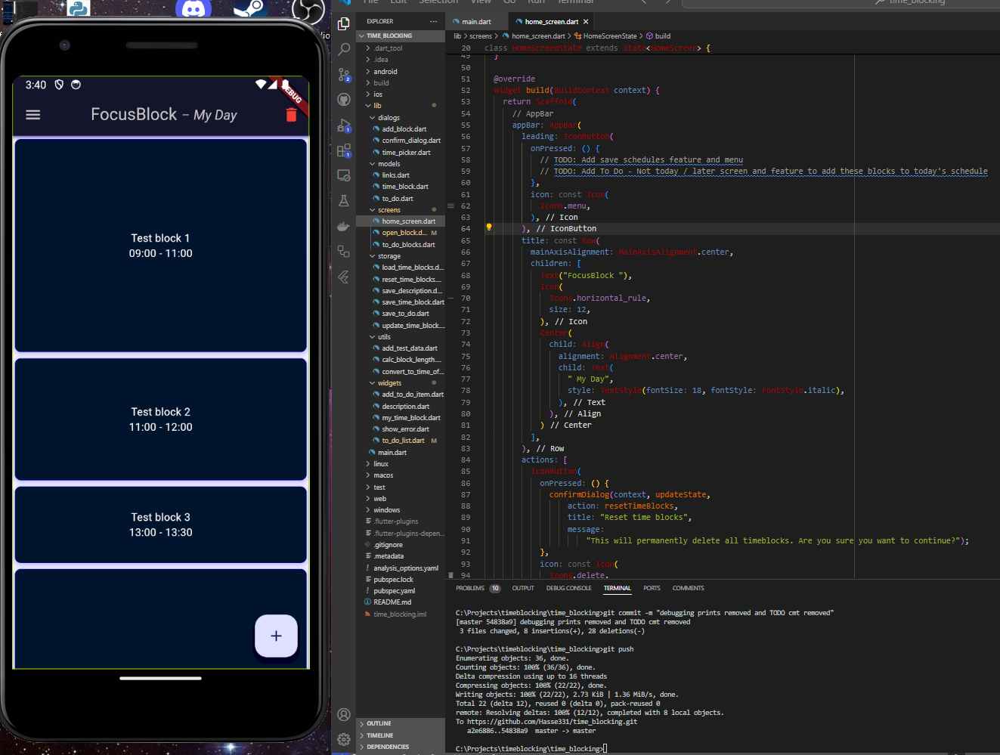

# Projects
This repository showcases other projects I've contributed to that are private and not visible on my profile.

# FocusBlock™ - Time management application
I did not find a good and simple time-blocking app in the Google Play Store, so I decided to make my own, which is minimalistic and simple enough. I personally don't like that mobile applications become distractions instead of tools to improve productivity, and this is the problem I try to fix with this project.

My initial goal is to develop core features and establish a solid codebase. Once this foundation is in place, I plan to expand FocusBlock™ into a comprehensive, cross-platform app with real-time data sync powered by Firebase or Supabase. The full version with cloud synchronization and cross-platform compatibility will be monetized through a monthly subscription.
  

# LAAR - Lapsen Arki
Working as team lead and full-stack developer.
https://lapsen-arki.fi

Web application is using stack of: Vite, MUI, TypeScript, Node.js, Firebase, Cypress, Jest, Azure, Docker.

My teammates working on this project were:
- [@esaleino](https://github.com/esaleino)
- [@saukkeli](https://github.com/saukkeli)
- [@jholopai](https://github.com/jholopai)
- [@nawzad-hassan](https://github.com/nawzad-hassan)
- [@johannaelisa](https://github.com/johannaelisa)

  

# Portfolio websites v1
My old (PHP) portfolio websites (slow initial load):
https://hasse-imberg-websites.onrender.com

Web application is using stack of: PHP, JavaScript, Python, AWS SES for email sending and hosing on Render.

