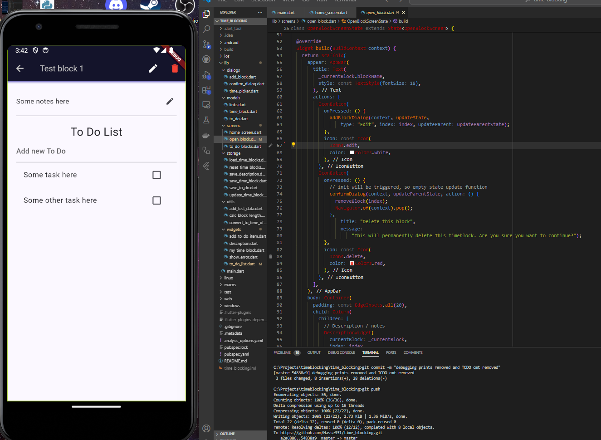

# Projects
This repository showcases other projects I've contributed to that are private and not visible on my profile.

# FocusBlock™ - Time management application
I did not find a good and simple time-blocking app in the Google Play Store or elsewhere, so I decided to make my own, which is minimalistic and simple enough. I personally don't like that mobile applications become distractions instead of tools to improve productivity, and this is the problem I try to fix with this project.

The goal is to make first base features and maintainable code structure, then optimize the application as a comprehensive cross-platform application with firebase/supabase backend with real-time data synchronizing. The full version of the application with cloud synchronizing and cross-platform features will be monetized based on a monthly SaaS subscription.
  

Test the live version of the application by:
 [Visiting the web version (UI not fully optimized)](https://focusblock-ten.vercel.app)
 or
 By installing the android APK from here:
 [Google drive link](https://drive.google.com/file/d/1WfeBbSTWtmMny2mFNNkr_BwZzN3tUFQm/view?usp=drive_link)

[View my current wakatime worktime for this project](https://wakatime.com/@018ea958-8683-4c8d-8e87-711366038480/projects/irlhtphant?start=2024-08-27&end=2024-09-02)
[View my FocusBlock coding reults here](results.md)

# LAAR - Lapsen Arki
Working as team lead and full-stack developer.
https://lapsen-arki.fi

Web application is using stack of: Vite, MUI, TypeScript, Node.js, Firebase, Cypress, Jest, Azure, Docker.

My teammates working on this project were:
- [@esaleino](https://github.com/esaleino)
- [@saukkeli](https://github.com/saukkeli)
- [@jholopai](https://github.com/jholopai)
- [@nawzad-hassan](https://github.com/nawzad-hassan)
- [@johannaelisa](https://github.com/johannaelisa)

  

# Portfolio websites v1
My old (PHP) portfolio websites (slow initial load):
https://hasse-imberg-websites.onrender.com

Web application is using stack of: PHP, JavaScript, Python, AWS SES for email sending and hosing on Render.

